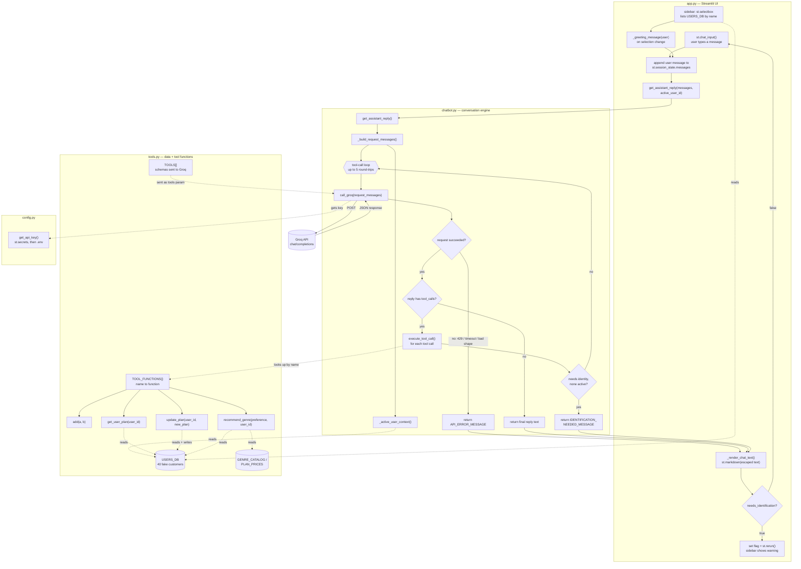

# Codebase Knowledge Graph

How the four Python files actually connect — real imports, real function calls, real data reads/writes — traced from the code, not summarized from memory. For what each file is *for*, see [ARCHITECTURE.md](ARCHITECTURE.md); this is the *wiring diagram*.

### Reading the diagram

- **Boxes grouped in a shaded rectangle** = one file. **Solid arrows** = a function calling another function, or control flow. **Dotted arrows** = an import, a data read/write, or "this value gets used over there" rather than a direct call.
- **The critical path** is `app.py → chatbot.py → tools.py`, and back up the same way. `app.py` never talks to Groq or to individual tool functions directly — everything about *deciding and running tools* is chatbot.py's job, and everything about *what tools actually do* is tools.py's job.
- **The tool-call loop** (`B_loop` → `call_groq` → tool_calls? → `execute_tool_call` → back to `B_loop`) is the one part of the diagram that can cycle — this is what lets the model chain multiple tools (e.g. look up a plan *and* get a recommendation) before answering, up to a 5-round-trip safety cap.
- **Two dead ends that skip Groq entirely**: the sidebar's greeting (`A_sidebar → A_greet`) is plain string formatting, and a failed request (`B_try` → `B_err`) or a missing identity (`B_needsid` → `B_idmsg`) both return a *fixed* message instead of asking the model to phrase one — deliberate, not a shortcut (see `DOCUMENTATION.md` §3.6–3.8 for why).
- **`config.py`** is the only file that reaches back out to `streamlit` from the "backend" side (checking `st.secrets`), which is why it's drawn as its own small file rather than folded into `chatbot.py`.
